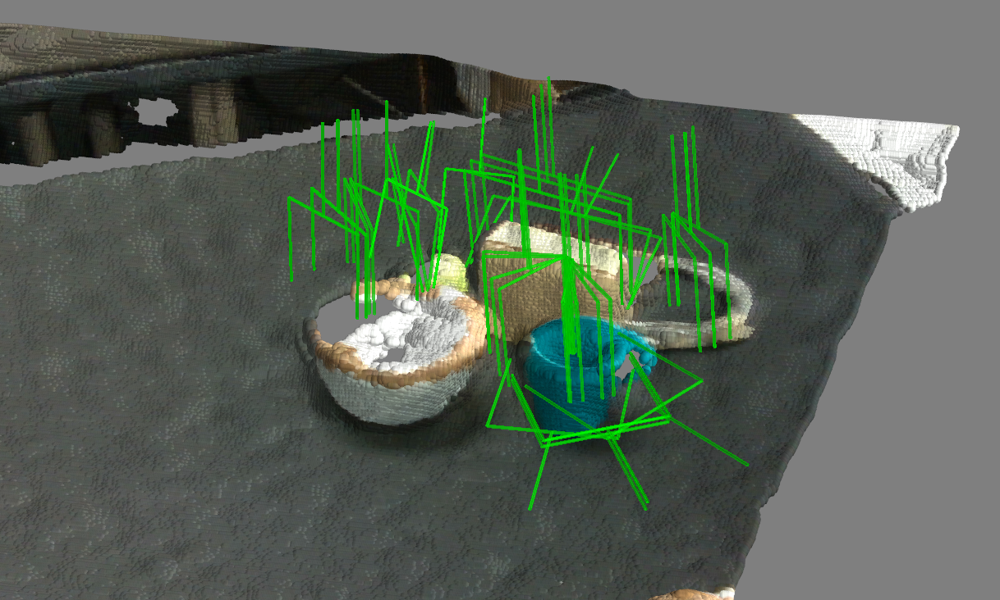

# Keypoint-GraspNet (KGN)
My implementation of paper "KGN-Pro: Keypoint-Based Grasp Prediction through Probabilistic 2D-3D Correspondence Learning" (IROS 2025).
[[paper](https://www.arxiv.org/pdf/2507.14820)]
<p align="center">
  
</p>

## Installation

1. create a new environment. 
    ~~~
    conda create -n kgn-pro python=3.8
    conda activate kgn-pro
    conda install pytorch==1.13.1 torchvision==0.14.1 torchaudio==0.13.1 pytorch-cuda=11.7 -c pytorch -c nvidia
    ~~~

2. Get the code.
    ~~~
    git clone git@github.com:WaitDerek/KGN-Pro.git 
    ~~~

3. Install the requirements
    ~~~
    pip install -r requirements.txt
    ~~~

4. Install and Compile Deformable Convolutional Networks V2 from [DCNv2_latest](https://github.com/jinfagang/DCNv2_latest). 

    ~~~
    cd $DCNv2
    python setup.py install --user
    ~~~

5. [Optional, only required if you are using extremenet or multi-scale testing] Compile NMS.

    ~~~
    cd ./src/lib/external
    make
    ~~~

## Train and evaluate

### Data generation

Put the dataset in the ``./data/`` folder.

Alternatively, you can also generate the data by yourself. For single-object data generation:

```bash
python main_data_generate.py --config_file lib/data_generation/ps_grasp_single.yaml
```

Multi-object data generation:

```bash
python main_data_generate.py --config_file lib/data_generation/ps_grasp_multi.yaml
```


### Train

First download pretrained [ctdet_coco_dla_2x](https://github.com/xingyizhou/CenterNet) model following the instruction. Put it under ``./models/``  folder.

Then run the training code.

```bash
bash experiments/train_kgnv{1|2}.sh {single|multi}
```

``single/multi``: Train on single- or multi-object data. 


### Evaluation

```bash
bash experiments/test_kgnv{1|2}.sh {single|multi} {single|multi}
```

First ``single/multi``: Evaluate the weight trained on single- or multi-object data. 

Second ``single/multi``: Evaluate on single- or multi-object data. 


### Acknowledgment
Thanks for these awesome works [KGN](https://github.com/ivalab/KGN) and [EPro-pnp-v2](https://github.com/tjiiv-cprg/EPro-PnP-v2)

### Troubleshooting
The following actions are required to resolve the conflict because of the version shown in [realease](https://github.com/pyro-ppl/pyro/releases/tag/1.9.0)

    cd $PATH_TO_KGN-PRO_ENV/lib/python3.8/site-packages/pyro/optim
    sed -i '38s/_torch_scheduler_base = torch.optim.lr_scheduler.LRScheduler/_torch_scheduler_base = torch.optim.lr_scheduler._LRScheduler/' pytorch_optimizers.py


复现小结
复现人：吕传杰

复现时间：2026年1月13日

复现结果：成功

复现概要：

环境配置，成功；
通过脚本运行测试代码，在多种场景下验证策略的鲁棒性，成功。